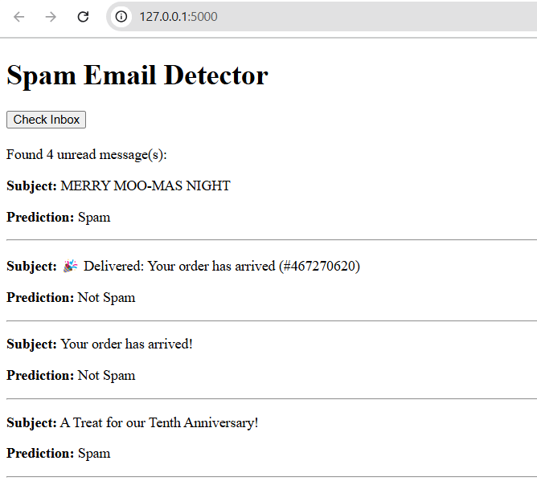

# Scam and Phishing Email A.I. detector
## CPSC 481 Project
Coded by: Amanda Shohdy, Luke Piña, Tasin Noor, & Brandy Nguyen

# Description:
This repository is an AI model that is able to detect spam in your email inbox. It utilizes Google's email API in order to read from a user's Gmail inbox. After connecting your Gmail account to the code, you will be able to run the code locally on your machine.  

# Installing packages:
- How to install scikit-learn & pandas
1. Type into the terminal "sklearn-env\Scripts\activate"
2. In the terminal enter "pip install -U scikit-learn"
3. In the terminal enter "pip install pandas"
4. In the terminal enter "pip install flask"
5. In the terminal enter "pip install --upgrade google-api-python-client google-auth-httplib2 google-auth-oauthlib"
   
# How to run:
1. git clone repo
2. Ensure you have the packages already downloaded
3. Enter in the terminal "python ./main.py" or "python3 ./main.py" to see model accuracy

GitHub repo: https://github.com/BrandyNguyen2/A.I.-Spam-Phishing-Email-Detector.git

